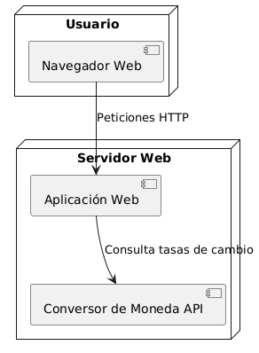
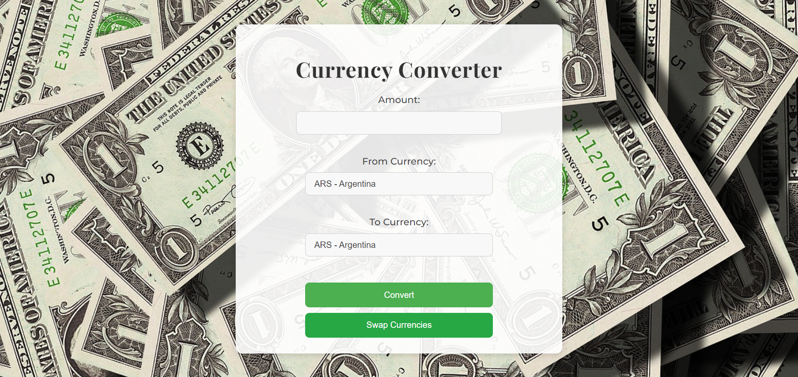
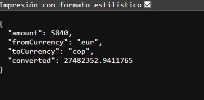
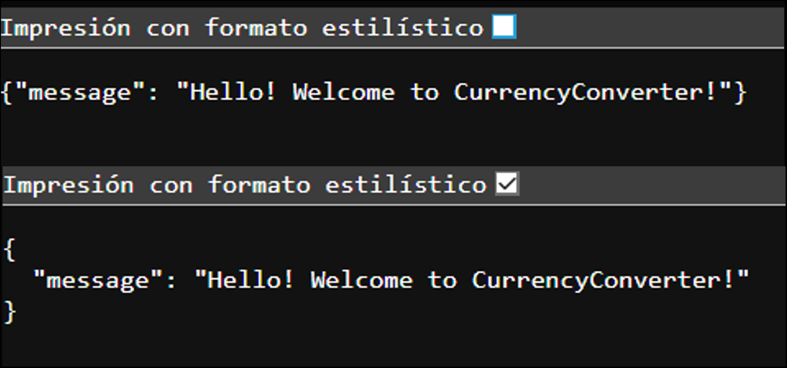
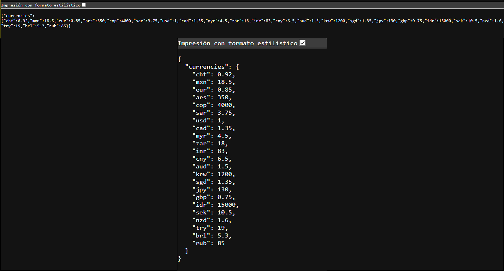
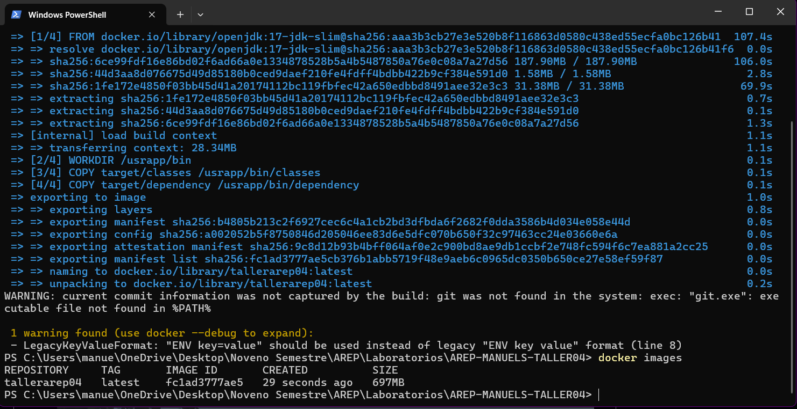
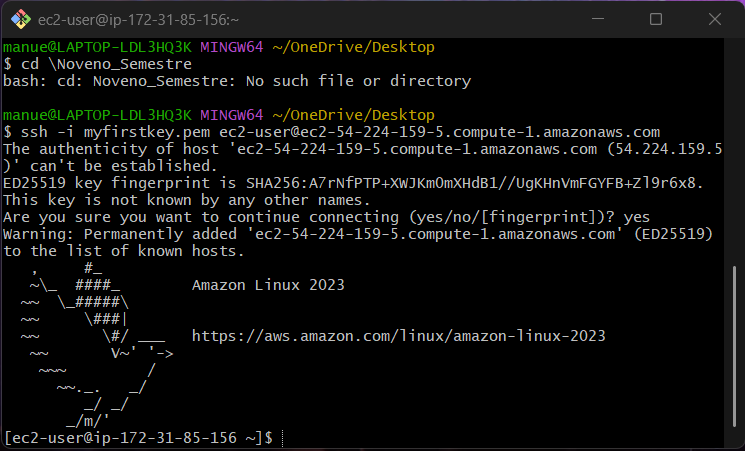
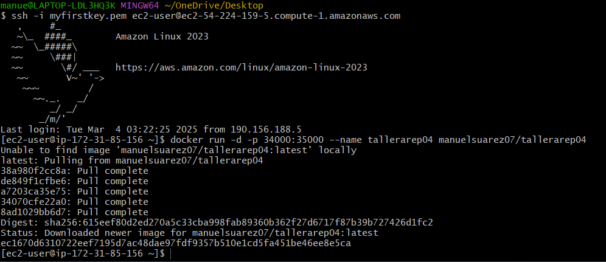
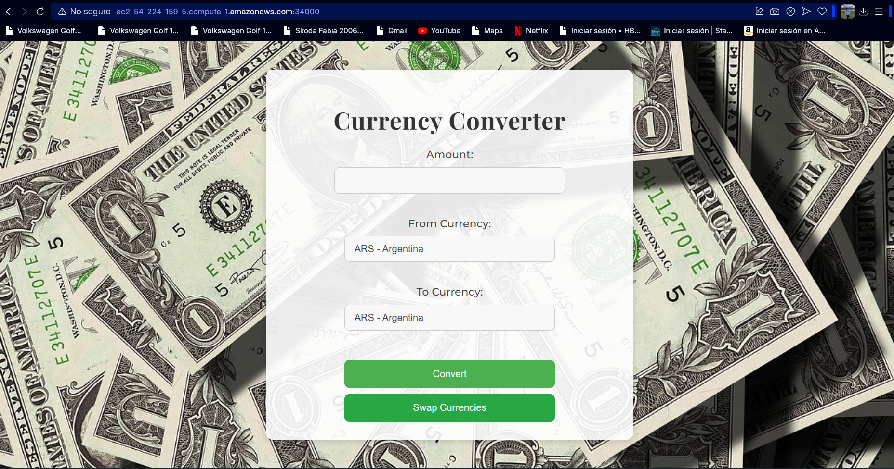
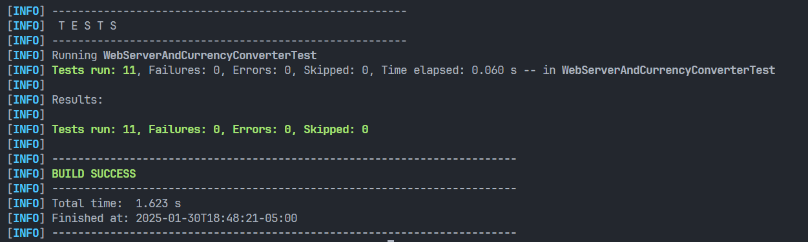

# Modularization with virtualization workshop and Introduction to Docker

The workshop consists of creating a small web application using SPRING. Once we have this application we will proceed to build a Docker container for the application and deploy and configure them on our local machine. Then, we will create a repository on DockerHub and upload the image to the repository. Finally, we will create a virtual machine in AWS, install Docker and deploy the container we just created.

## Features

- Converts between various currencies using predefined exchange rates.
- Serves static HTML, CSS, and JavaScript files.
- Handles different content types such as HTML, CSS, JS, JPG, and PNG.
- Provides a RESTful API endpoint for currency conversion.
- Includes unit tests for core functionalities.

## Project Structure

```
├── src/
│   ├── main
│   │   ├── java/com/eci/
│   │   │   ├── Annotation/
│   │   │   │   ├── GetMapping.java         # Annotation for handling GET requests
│   │   │   │   ├── PostMapping.java        # Annotation for handling POST requests
│   │   │   │   ├── RequestBody.java        # Annotation for binding request bodies
│   │   │   │   ├── RequestParam.java       # Annotation for binding request parameters
│   │   │   │   ├── RestController.java     # Annotation to mark controller classes
│   │   │   ├── Controller/
│   │   │   │   ├── CurrencyController.java # API for managing currencies and exchange rates
│   │   │   │   ├── GreetingController.java # Example controller for basic greeting responses
│   │   │   ├── Server/
│   │   │   │   ├── CurrencyConverter.java  # Logic for currency conversion
│   │   │   │   ├── Request.java            # Handles HTTP requests
│   │   │   │   ├── Response.java           # Handles HTTP responses
│   │   │   │   ├── Service.java            # Core service for web server operations
│   │   │   │   ├── WebServerT4.java        # Webserver
│   │   │   ├── MainApplication.java        # Main class
│   ├── resources/
│   │   ├── images/
│   │   │   ├── fondo.jpg                   # Background image
│   │   ├── static/
│   │   │   ├── index.html                  # Front-end interface for currency conversion
│   │   │   ├── script.js                   # Front-end logic for interactions
│   │   │   ├── style.css                   # Styling for the front-end
│   ├── test/
│   │   ├── java/
│   │   │   ├── WebServerAndCurrencyConverterTest.java # Unit tests for server and converter
├── README.md                              # Project documentation
├── pom.xml                                # Maven configuration

```
## Architecture

### Deployment Diagram



### Components

- **HTML**: Serves as the front-end interface for user interaction.
- **CSS**: Styles the web interface to ensure a clean and modern look.
- **JavaScript**: Manages API calls and updates the UI dynamically.
- **HTTP Server**: Handles requests for static files and API endpoints.

## Setup and Installation

### Prerequisites

1. **Java Development Kit 23 (JDK23)**
   * Ensure you have the following installed:
      - Java Development Kit (JDK23)
        ```sh
        java -version
        ```
      
      - **Maven** (if using for dependency management)
        ```sh
        mvn --version
        ```
2. If not installed, download it from the:
   - Oracle Website: [official Oracle website](https://www.oracle.com/java/technologies/javase-jdk11-downloads.html).
   - Apache Maven: [Apache Maven website](https://maven.apache.org/download.cgi).

### Installing and Running the Web Server

1. Clone the repository:
   ```sh
   git clone https://github.com/ManuelSuarez07/AREP-MANUELS-TALLER04.git
   ```
2. Navigate to the project directory:
   ```sh
   cd AREP-MANUELS-TALLER04-main
   ```
3. Compile the project:
   ```sh
   mvn clean install
   ```
4. Start the server:
   ```sh
   mvn exec:java
   ```
5. Open a browser and navigate to:
   ```
   http://localhost:35000
   ```
   
## Currency Converter
### User Guide
#### This is the main page where users can convert currencies. To use the converter, simply enter the amount you want to convert, select the source and target currencies from the dropdown menus, and click the "Convert" button. The result will be displayed below, showing the converted amount.



#### Example Response:


### Check URI
We can use too the following requests to test the services:

convert 5840 EUR to COP
  ```sh
   http://localhost:35000/convertir?fromCurrency=EUR&toCurrency=COP&amount=5840
  ```
  

### Test and Query API Endpoints
We can use the following requests to test the services:

Greeting Service, access the greeting service with:
  ```sh
  http://localhost:35000/api/greeting  
  ```
  
Add a New Currency (POST), add a new currency and its exchange rate with the following request:
  ```sh
  POST http://localhost:35000/api/currencies  
Body:  
{  
    "name": "newCurrency",  
    "rate": 123.45  
}   
  ```
Get All Currencies (GET), retrieve all available currencies and their exchange rates:
  ```sh
  http://localhost:35000/api/currencies  
  ```
  

## Docker
#### This part consists of the implementation in Docker
1.

2.

3.

4.

5.

6.

7.

8.

9.

10.
[Descargar el video](src/main/resources/images/DockerVid.mp4)

## AWS
#### This part consists of the implementation in AWS
1.

2.

3.

4.
[Descargar el video](src/main/resources/images/AWSVid.mp4)

## Running the Tests

To execute unit tests, use JUnit:

```sh
mvn test
```



## Built With

- **Java Development Kit** - Core programming language
- **Maven** - Dependency management
- **Git** - Version control

## Authors

- ManuelSuarez07

## Version

Version 4.0
