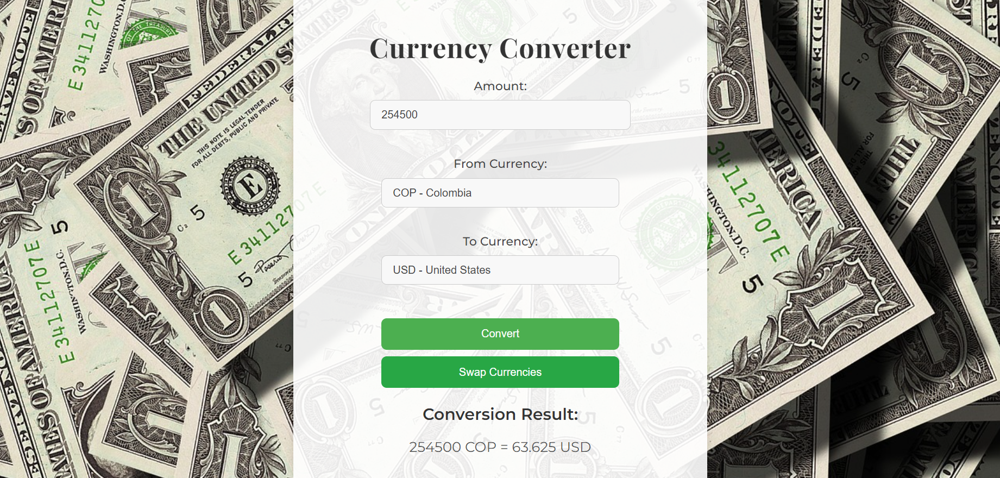

# Currency Converter Web Server

This project implements a simple web server (`WebServerT1`) that serves static files and provides an API for currency conversion using the `CurrencyConverter` class. It also includes a front-end web interface with an interactive currency converter.

## Features

- Converts between various currencies using predefined exchange rates.
- Serves static HTML, CSS, and JavaScript files.
- Handles different content types such as HTML, CSS, JS, JPG, and PNG.
- Provides a RESTful API endpoint for currency conversion.
- Includes unit tests for core functionalities.

## Project Structure

```
├── src/
│   ├── main
│   │   ├── java/com/eci/webservert1/
│   │   │   ├── WebServerT1.java         # Web server implementation
│   │   │   ├── CurrencyConverter.java   # Currency conversion logic
│   │   ├── resources/
│   │   │   ├── images
│   │   │   │   ├── Initial.png             
│   │   │   │   ├── Result.png
│   │   │   │   ├── Test.png                           
│   │   │   ├── static
│   │   │   │   ├── index.html           # Front-end interface
│   │   │   │   ├── style.css            # Styling
│   │   │   │   ├── script.js            # Front-end logic
│   │   │   │   ├── fondo.jpg            # Background image
│   ├── test
│   │   ├── java
│   │   │   ├──WebServerAndCurrencyConverterTest.java  # Unit tests
├── README.md                            # Project documentation
└── pom.xml                              # Maven configuration (if applicable)
```
## Architecture

### Deployment Diagram


### Components

- **HTML**: Serves as the front-end interface for user interaction.
- **CSS**: Styles the web interface to ensure a clean and modern look.
- **JavaScript**: Manages API calls and updates the UI dynamically.
- **HTTP Server**: Handles requests for static files and API endpoints.

## Setup and Installation

### Prerequisites

1. **Java Development Kit (JDK)**
   * Ensure you have the following installed:
      - Java Development Kit (JDK)
        ```sh
        java -version
        ```
      
      - **Maven** (if using for dependency management)
        ```sh
        mvn --version
        ```
2. If not installed, download it from the:
   - Oracle Website: [official Oracle website](https://www.oracle.com/java/technologies/javase-jdk11-downloads.html).
   - Apache Maven: [Apache Maven website](https://maven.apache.org/download.cgi).

### Installing and Running the Web Server

1. Clone the repository:
   ```sh
   git clone https://github.com/ManuelSuarez07/AREP-MANUELS-TALLER01.git
   ```
2. Navigate to the project directory:
   ```sh
   cd AREP-MANUELS-TALLER01-main
   ```
3. Compile the project:
   ```sh
   mvn clean install
   ```
4. Start the server:
   ```sh
   mvn exec:java
   ```
5. Open a browser and navigate to:
   ```
   http://localhost:35000
   ```
   
## Currency Converter
### User Guide
#### This is the main page where users can convert currencies. To use the converter, simply enter the amount you want to convert, select the source and target currencies from the dropdown menus, and click the "Convert" button. The result will be displayed below, showing the converted amount.


#### Example Response:



## Running the Tests

To execute unit tests, use JUnit:

```sh
mvn test
```


## Built With

- **Java Development Kit** - Core programming language
- **Maven** - Dependency management
- **Git** - Version control

## Authors

- ManuelSuarez07

## Version

Version 1.0

